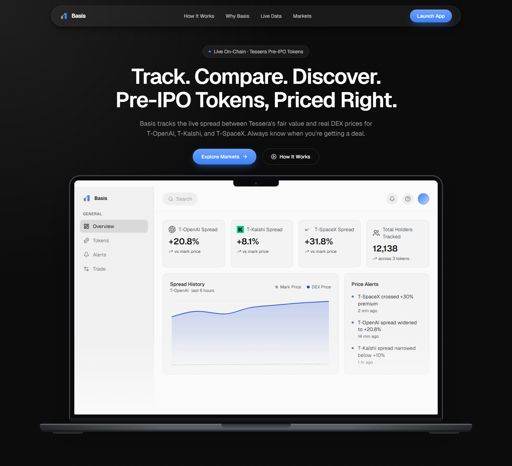
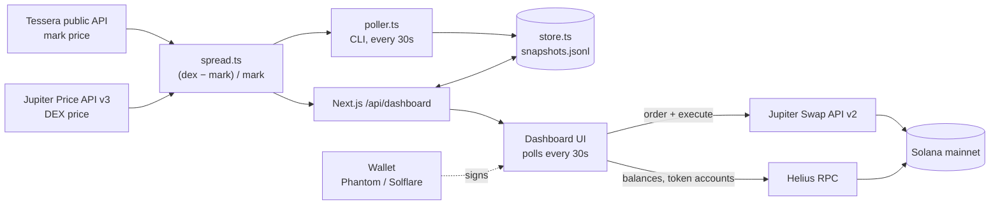

# Basis

Fair-value signals and one-click execution for Tessera's pre-IPO tokens on Solana.

**[Live app](https://basis-spread.vercel.app)** · [Demo video — link coming] · [Stocklana hackathon](https://hackathons.solana.com/hackathons/stocklana)

<!-- Hero screenshot: add the image at docs/screenshots/hero.png -->


## The problem

Tessera's T-Tokens (T-OpenAI, T-Kalshi, T-SpaceX) trade 24/7 on Solana DEXs, but the DEX price is set by whoever is trading at that moment, and thin liquidity can push it far from Tessera's own reference valuation. Tessera doesn't run its own trading venue: per its docs, buys and sells route through third-party DEXs (primary liquidity on Meteora, reached through aggregators like Jupiter). Our own checks agree: Jupiter currently routes USDC → T-Token buys through Meteora DLMM pools. So there's no single place that tells a trader whether they're overpaying or getting a discount, and then lets them act on it.

## What Basis does

- **Tracks two prices per T-Token:** Tessera's mark price (Tessera's public API) and the live DEX price (Jupiter Price API).
- **Computes the spread:** `(dex − mark) / mark`.
- **Turns it into a signal:** below mark is a discount, framed as an entry point. Above mark is a premium, flagged plainly rather than framed as a buy; holders can switch to Sell.
- **Keeps history and alerts:** every snapshot is stored, and the charts, stats and threshold alerts are built from that history.
- **Lets you act immediately:** connect a Solana wallet and buy or sell with SOL, USDC or USDT, priced and executed through Jupiter.

## Why it matters for Tessera

Basis doesn't build a new venue or bonding curve. It's a demand layer on top of the liquidity T-Tokens already trade on: every trade through Basis is real on-chain volume into T-Token pools, and surfacing mispricings gives traders a reason to push prices back toward fair value.

> Tessera doesn't operate its own trading venue — all T-Token trades settle on Meteora/Jupiter. Basis is the missing layer: the fair-value signal Tessera's own dashboard doesn't provide, paired with one-click execution on the same infrastructure Tessera itself routes through.

**Isn't this just a Jupiter wrapper?** Jupiter is the execution plumbing. It's how T-Tokens trade at all, so any honest trading interface for them uses it. What Basis adds is everything around the swap: the fair-value comparison, its history, the alerts, and framing each trade around whether you're paying a premium or getting a discount.

## Why Solana

T-Tokens are SPL Token-2022 mints on Solana mainnet (checked on-chain for all three). 24/7 settlement, sub-second confirmations and low fees make it practical to act on a short-lived spread, which a brokerage app with market hours and settlement delays can't offer.

## Features

- **Landing page:** product overview with a MacBook-framed dashboard preview.
- **Overview:** per-token spread cards (mark, DEX, spread), a mark-vs-DEX history chart, live alerts, and a market activity table.
- **Markets:** every tracked token with totals (market cap, holders, average spread). Click a token for a candlestick chart (6H / 24H / 7D / All) built from stored snapshots.
- **Trade:** pick a token and see the spread banner (discount vs premium), a price chart, and a swap panel with Buy/Sell tabs, pay with SOL / USDC / USDT, 25% / 50% / 100% balance quick-fill, a live Jupiter quote with price impact, wallet signing, and a Solscan link on confirmation.
- **Spread History:** per-token highest / lowest / average spread, a full-width chart, and a paginated raw snapshot table.
- **Alerts:** every token's current alert status, filterable by severity and token.
- **Wallet:** connected address (copyable), SOL / USDC / USDT balances, and T-Token holdings read from the wallet's token accounts.
- **Settings:** theme, default token and timeframe (used by Spread History), and alert-notification preferences (saved locally; nothing is sent yet).
- **Light / dark mode** across the app, and **mobile-responsive** layouts.
- **Wallets:** Phantom and Solflare adapters; other Wallet Standard wallets are detected automatically.

## How it works



The web app imports the backend modules directly (compiled to `dist/`), so the API route and the CLI poller share one implementation.

| File | Role |
| --- | --- |
| `src/tessera.ts` | Fetches every listed T-Token (mark price, mint, holders, valuation) from `rest-api.tessera.pe/v1/public/token-details`. |
| `src/jupiter.ts` | Batch USD prices from Jupiter Price API v3 (keyless tier by default). |
| `src/spread.ts` | Joins the two by mint and computes the spread. Skips a token Jupiter can't price instead of failing. |
| `src/store.ts` | Append-only JSON-lines snapshot store (`data/snapshots.jsonl`, or `BASIS_DATA_DIR`). |
| `src/poller.ts` | CLI loop that computes and stores a snapshot every 30 seconds. |
| `web/src/app/api/dashboard/route.ts` | Computes fresh spreads per request, stores them, and returns spreads plus history. Falls back to the last stored snapshot per token if Tessera or Jupiter fails. |
| `web/src/lib/jupiter-order.ts` | Swap API v2: `/order` builds the transaction, the wallet signs it, `/execute` submits it. |
| `web/src/app/dashboard/use-wallet.tsx` | SOL / USDC / USDT balances over the configured RPC. |
| `web/src/lib/alerts.ts` | Alert thresholds and severity. |
| `web/src/app/dashboard/_components/candlestick-modal.tsx` | Buckets stored price snapshots into OHLC candles. |

## Data integrity

- **The dashboard is live.** Mark price comes from Tessera, DEX price from Jupiter, and the spread is computed from both on every request. History comes from real stored snapshots. Nothing in the dashboard is simulated.
- **Upstream outages don't produce fake data.** If Tessera or Jupiter is unreachable, the API returns the last stored snapshot per token, flagged as stale, and the Overview shows a banner saying cached figures are being shown. If there's no stored snapshot either, the dashboard says no data is available.
- **Candles are derived, not exchange-native.** They're OHLC buckets of our stored DEX price snapshots.
- **The landing page uses sample numbers.** Its product previews (the hero dashboard, How It Works, Watch The Gap Move, and the closing-CTA spread pills) use illustrative figures from `web/src/lib/dashboard-data.ts`. The only live element on the landing page is the footer's live-status block.

## Tech stack

- Next.js 16 (App Router), React 19, TypeScript, Tailwind CSS 4
- `@solana/wallet-adapter` (react, react-ui, wallets), `@solana/web3.js`
- Jupiter Price API v3 and Swap API v2 (order / execute)
- Tessera public REST API
- Helius RPC (Solana mainnet)
- Recharts (line and area charts), Lightweight Charts by TradingView (candlesticks), Framer Motion, Lucide icons
- Backend scripts on Node with `tsx`
- Hosted on Vercel

## Running locally

Requires Node 20.9+ (developed on Node 24) and a Solana mainnet RPC URL, for example from [Helius](https://www.helius.dev).

```bash
git clone https://github.com/Im-2/Basis.git
cd Basis
npm install                 # backend: TypeScript + tsx
cd web
npm install                 # web app
cp .env.example .env.local  # then fill in the values below
npm run dev                 # compiles the backend to ../dist first, then starts Next.js
```

Open http://localhost:3000.

| Variable | Used by | Required | Purpose |
| --- | --- | --- | --- |
| `NEXT_PUBLIC_SOLANA_RPC_URL` | web | Recommended | Mainnet RPC for wallet balances. Falls back to the public mainnet-beta RPC, which rate-limits quickly. |
| `BASIS_DATA_DIR` | web, poller | Yes (web) | Absolute path to the snapshot store. Point it at the repo's `data/` folder so the web app and the poller share one file. |
| `JUPITER_API_KEY` | web, poller | Optional | Uses Jupiter's paid Price API host instead of the keyless tier. |
| `POLL_INTERVAL_MS` | poller | Optional | Poll interval in ms (default `30000`). |

The web app reads `web/.env.local`. The poller does not read that file, so set its variables in your shell. Its default store location is already the repo's `data/` folder.

**Optional: the poller.** The dashboard stores a snapshot on each API request, so the poller only matters for building history while nobody has the dashboard open. Run these from the repo root:

```bash
npm run poll                    # compute and store a snapshot every 30s
npm run once                    # a single cycle
npm run history -- T-OpenAI     # print stored history (omit the symbol for all tokens)
npm run diagnose                # compare Jupiter quotes at several trade sizes against the Price API
```

History lives in `data/snapshots.jsonl`, which is gitignored, so a fresh clone starts with no history.

**Deploying to Vercel:** set Root Directory to `web` and Install Command to `npm install --prefix .. && npm install`, so the backend's dependencies get installed too. Set `NEXT_PUBLIC_SOLANA_RPC_URL`, and `BASIS_DATA_DIR=/tmp/basis-data` (the only writable path on Vercel).

## Known limitations

- **Mainnet only.** T-Tokens have no devnet deployment, so every trade uses real funds.
- **Short history.** Collection started during the hackathon.
- **Hosted history is shorter still.** On Vercel the store lives in `/tmp`, which resets on cold starts and redeploys, and no background poller runs there. History only grows while people use the dashboard, so charts on the live app can look sparse. A local run with the poller keeps continuous history.
- **The store is a JSON-lines file** with no locking or retention. Fine for a demo; production needs a real database, which would also fix the point above.
- **DEX price is Jupiter's single reference price,** not a size-specific quote. For larger orders the executed price differs; the Trade panel shows the real quote and price impact before you sign.
- **Alerts only cover premiums.** Thresholds fire above +10% / +25% and on a narrowing spread; a large discount is currently labelled low severity. Alerts are evaluated live and not stored as a history.
- **The stale-data banner is on the Overview only.** Other pages show the same cached figures without it.
- **Notifications:** preferences are saved, but nothing is sent yet.
- **Transaction history** isn't stored; confirmations link to Solscan.
- **No platform fee** is implemented yet.
- **New Tessera listings get partial support.** The data pipeline picks them up automatically (it reads Tessera's full token list), but the UI has hand-added icons for the current three, so a new token shows a fallback icon.
- **Rate limits.** Jupiter is used on its keyless, rate-limited tiers unless `JUPITER_API_KEY` is set.
- **No automated tests** yet.

## Roadmap

- Platform fee via Jupiter's referral program (the planned revenue model)
- Push and Telegram alerts, including discount-side thresholds
- A hosted database for history, alerts and trade history
- More Tessera tokens as they list
- Sell-side automation, for example alert-triggered limit orders

## Hackathon and credits

Built for the Stocklana hackathon (Solana Foundation): Main Track and the Tessera bounty.

- **Tessera:** T-Tokens and the public token-details API (mark price, holders, valuation)
- **Jupiter:** Price API v3 and Swap API v2 for pricing and execution
- **Helius:** mainnet RPC
- **Meteora:** the DLMM pools T-Token trades settle on

Open-source components used:

| Component | License |
| --- | --- |
| Next.js, React, Tailwind CSS | MIT |
| TypeScript | Apache-2.0 |
| Solana wallet-adapter | Apache-2.0 |
| `@solana/web3.js` | MIT |
| Recharts | MIT |
| Lightweight Charts by TradingView | Apache-2.0 |
| Framer Motion | MIT |
| Lucide | ISC |
| `tsx` | MIT |
| Geist font (Vercel) | SIL OFL 1.1 |

Brand marks (OpenAI, SpaceX, Kalshi, SOL, USDC, USDT, X, GitHub) belong to their owners and are used only to identify tokens and links.

## Disclaimer

Not financial advice. T-Tokens represent loan participation rights, not equity. Tessera is unavailable in certain jurisdictions — see Tessera's terms.
